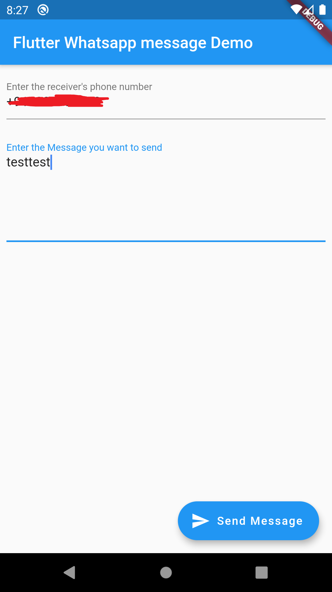

# flutter_twilio_whatsapp

A whatsapp message sender, powered by Twilio.

## Getting Started

 

A Whatsapp messenger implemented in Flutter, powered by Twilio (https://www.twilio.com/docs/whatsapp).

Get your Account Id and Auth Token (sid). These can be found from https://www.twilio.com/console.